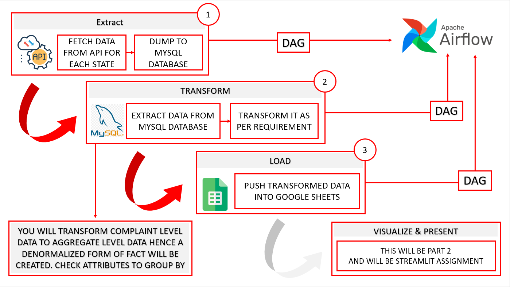

#  FIRST QUARTER

 

### 1)Python For Data Engineering
### 2)Web API's Like Flask and Fastapi
### 3) DataSCRAPPING
### 4)MYSQL
### 5)Stream processing(Kafka) And Batch Processing
### 6)ETL PiPelines
### 7)Linux
### 8)Git
### 9)Airflow

 

`Project1:`
``` 
Case 1: Ecommerce Store Data Scraping for Market Research I successfully completed a project where I developed a web scraping solution to extract data from an Ecommerce store (https://www.lushusa.com/) on a daily basis. The objective was to gather market research insights specifically related to conditioners and hair products. I implemented a scraping script to extract product details such as names, prices, descriptions, and customer ratings from the specified categories. The extracted data was cleaned, processed, and stored in a structured format for further analysis. This project involved automation of the scraping process and generating reports for market research purposes.

Case 2: Airfare Website Data Scraping and Comparative Excel Report
I have experience in scraping data from multiple airfare websites and creating a comparative Excel report for the same itinerary. In this project, I selected relevant airfare websites and developed a web scraping solution to extract pricing information for a specific travel plan. I collected flight details, departure/arrival times, airlines, and fares from various websites. The scraped data was cleaned, consolidated, and transformed to generate a comparative Excel report. The report included price comparisons, lowest fares, average prices, and other relevant metrics across the selected websites. The project involved automation to regularly update the comparative report and utilized data visualization techniques for enhanced presentation.
```

`Project2:`
```
I successfully completed a market research data scraping project where I was tasked with extracting data from multiple Ecommerce stores on a daily basis. The goal was to gather insights from websites such as Daraz and Bagallary, which listed similar products. I developed a web scraper that ran automatically at 8:00 AM daily to collect the required data.

To ensure ease of testing for non-IT individuals, I also added a REST API layer. This allowed anyone to access the results using a designated API endpoint. The API provided a user-friendly interface for viewing the collected data without the need for technical knowledge.

As part of the project deliverables, I prepared a SQL file containing two days' worth of scraped data. Alongside the SQL file, I included the source code for the web scraper, showcasing my proficiency in developing scraping scripts and integrating REST API functionality.

This project highlighted my expertise in web scraping, data extraction from multiple websites, automation, REST API development, and database management.

```

`Project3:`

`FINAL ASSIGNMENT : SCRAP - INGEST - ORCHESTRATE - DEPLOY`

`Preamble: This Assignment will be testing all your previously learned knowledge to demonstrate a integrated understanding of process involved to bring data into useful information with process such as Acquisition, Transformation, Orchestration and Delivery/Deployment on Cloud `
        
 ```
As a Data Engineer at the Consumer Financial Protection Bureau (CFPB), I was assigned a critical task by the Director of Data Engineering. The objective was to design and implement a data architecture to provide up-to-date dashboards for internal stakeholders' monitoring purposes. The task involved setting up a complete backend with Airflow and designing a dashboard frontend with Streamlit.

CFPB is a U.S. government agency that ensures fair treatment by banks, lenders, and other financial companies. The assignment required leveraging an existing API provided by CFPB, which allows data retrieval based on parameters such as state, from date, and to date.

To accomplish this task, the following steps were taken:

Backend Setup with Airflow:
I created a backend infrastructure using Airflow, an open-source platform for orchestrating and scheduling data workflows. The Airflow setup included creating DAGs (Directed Acyclic Graphs) and modular ETL (Extract, Transform, Load) scripts. These scripts were designed to retrieve data from the API, perform necessary transformations, and load it into the desired storage or database.

Dashboard Frontend with Streamlit:
I designed a user-friendly and interactive dashboard frontend using Streamlit, a Python library for building data applications. The Streamlit-based dashboard presented the processed data in a visually appealing manner, allowing stakeholders to monitor and analyze the information effectively.

To demonstrate my work, I prepared a zip file containing the following components:

Folder: It contained the Airflow DAG file and modular ETL scripts, adhering to the instructions provided in the "Airflow Instruction Tab" document. These files showcased my proficiency in designing and implementing data workflows using Airflow.

Documentation: I provided clear documentation explaining the steps involved in the data engineering process, including the architecture design, data retrieval from the API, transformation procedures, and data storage mechanisms.

This assignment allowed me to showcase my skills in backend setup with Airflow, data extraction from APIs, data transformation, and frontend development using Streamlit. By successfully completing this task, I demonstrated my ability to deliver a comprehensive data engineering solution for real-world business requirements.
```
