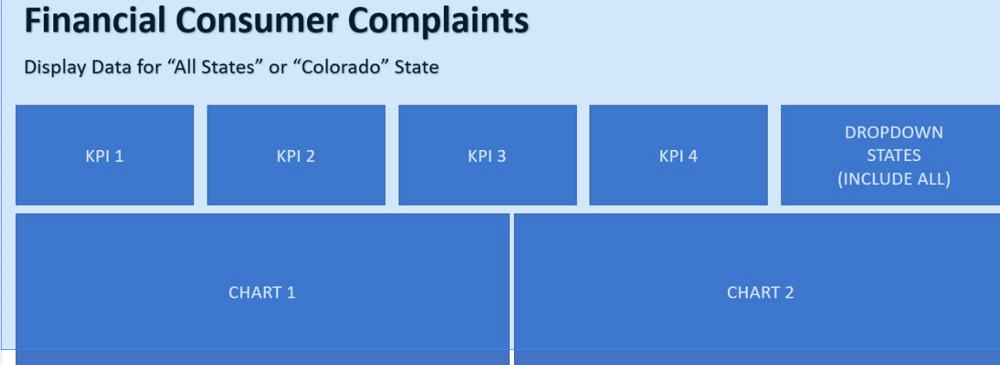

# THIRD QUARTER

 

### 1) BIG DATA AND DATA ORCHESTRATION
      .  Pentaho Spoon(ETL)
      .  Big Data & Hadoop
      .  Apache Spark & RDDs
      .  SparkSQL for Structured Data
      .  SCD2 Implementation (Mandatory)
      .  ETL DwH using PySpark
      .  Essential Scripts for DwH
      .  

### 2) Streamlit   
       . Dashboard

 

 

 

 
`Project1:ETL DwH using PySpark SCD TWO IMPLEMENTATION`
 
 ```
  Data Source : MySQL SQL Script is Attached to Populate OLTP Database

Know your Database First : https://www.youtube.com/watch?v=nIyztxl8Ziw

We will be using above MySQL Database for this assignment.


Requirement Section 1: Star Schema (25 Marks)

- Create a Proper Star schema Model Diagram of the above mentioned database and share its proper ERD screenshot from any tool.  

- Create both dimension tables and fact tables in the database

 


Mandatory Instructions >

> Fact Modelling : Define Grain of Fact with Order and Order Detail (Remove Shipping Related Details from Order Table)
> Your Fact should contain FKs for Employees, Customers and Products

> Dimension Modelling : Denormalization of 
Employees Table (Fold / Merge Territories)
Customers (Fold / Merge Demographics)
Products (Fold / Merge Categories)
Ignore Shippers & Suppliers

- Create is_current, effective start and effective end date columns in each dimensions so that you can implement scd2

- Model Date Dimension with the fact

Also write a note explaining your work how you have approached the problem and structured OLAP Schema.

Rubric of Evaluation: (25 Marks)

Requirement 1:
Screenshot of the ERD Diagram Created in Lieu of OLAP (15 Marks)
Explanation of your work of How you have designed and Approached Problem from OLTP to OLAP & SCD Implementation (10 Marks)


Requirement Section 2: PySpark & MySQL (60 Marks)

Create MySQL Procedures & Scripts to Generate the Schema and Data Migration from OLTP data in OLAP as per your Star Schema for all the dimensions (Including Date) and Fact.

Implement a PySpark SCD on Employees Dimension You can use Either of SparkSQL or SparkNative API.
For PySpark Files & Resources : Navigate to Topic "Big Data with Apache Spark" for Files

Validation of SCD2 Implementation: Demonstrate Below Test Cases on Employee dimension
- A Case where a New Record is inserted
- A Case where a Record is Updated

You will show an SCD Before the Test Case and SCD After the Test Case

Rubric of Evaluation: (60 Marks)

Requirement 2:
- MySQL Procedures to Migrate Data from OLAP to OLTP (5 Procedures) (25 Marks (5 for Each))
- Implementation of SCD Update in Apache Spark for Employees Dimension (25 Marks (Step 5 to Step 9, 5 Marks Each))
- Testing Validation of Working SCD (10 Marks, 5 Marks for each Case)
```

`Project2:Dashboard Making Using Spark OF Financial Consumer Complain`

